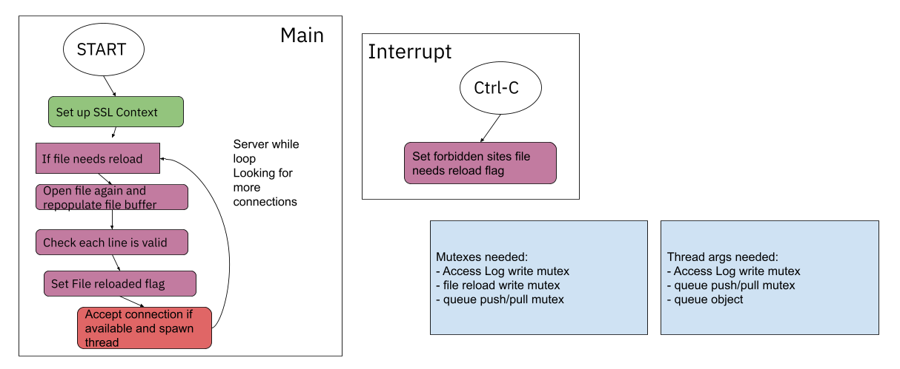
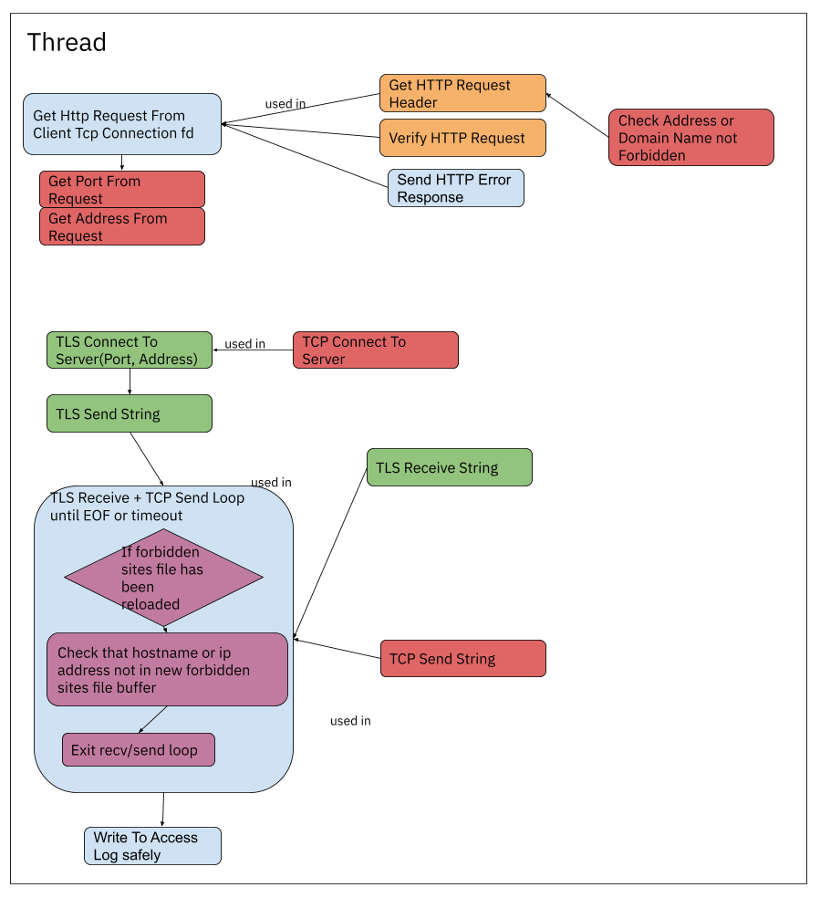
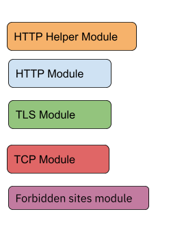

# TLS Web Proxy
## Description
This command line tool is meant to be run as a proxy for cleartext HTTP requests on a local machine. One way of visualizing the proxy's functionality is this:

## Features
### Hot Reload
The TLS web proxy takes a command-line argument for a plain text file to maintain a list of forbidden websites and IP addresses that Proxy clients cannot access. This list can be reloaded while the proxy is running by changing the file, saving your changes, and performing a signal interrupt on the command-line (Ctrl-C).
## Architecture
The tool is built using OpenSSL for performing secure HTTP requests concurrently and is split into modules for easier testing and source control. To visualize the program functionality, the flow chart and a legend below show the function of the main program loop, a worker thread, and the signal interrupt handler. The legend only tells us how the source code is organized into separate modules.

Legend:
